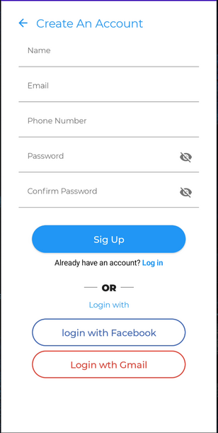

# SignupCompose
Generate flow signup witch JetpackCompose

For more information, please [read the documentation](https://developer.android.com/jetpack/compose)

💻 Requirements
------------
To try out these sample apps, you need to use [Android Studio Arctic Fox](https://developer.android.com/studio).
You can clone this repository or import the
project from Android Studio following the steps
[here](https://developer.android.com/jetpack/compose/setup#sample).

Preview
-----------

Test
-------------
user = user@gmail.com

pass = password

the proyect focus only flow login and register using navigationComponent and shared data into screens using arguments.
